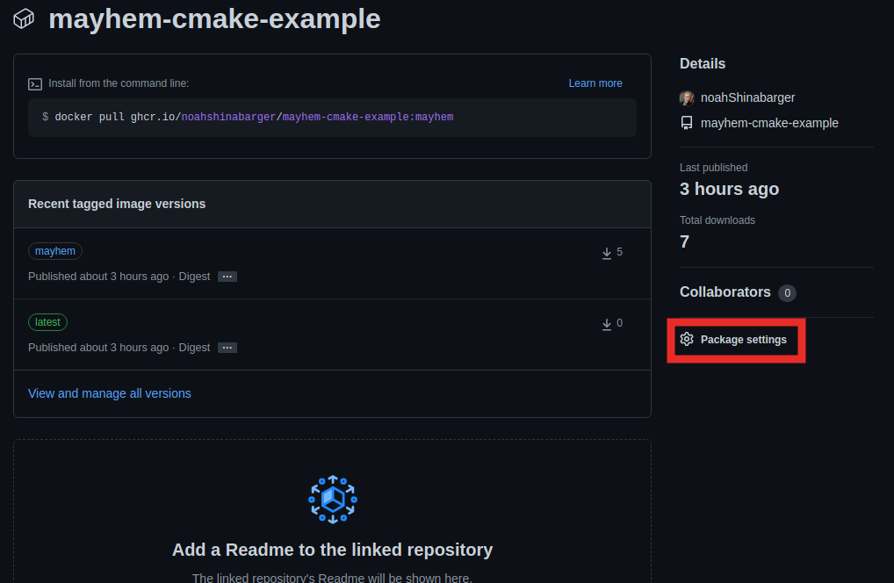
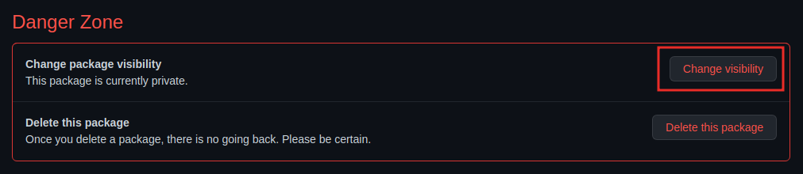
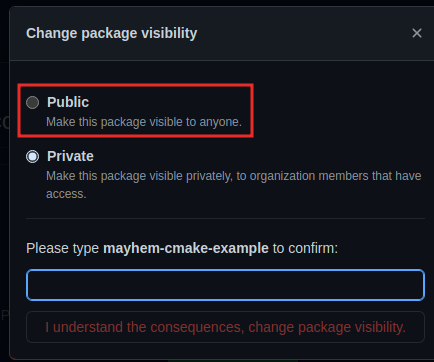
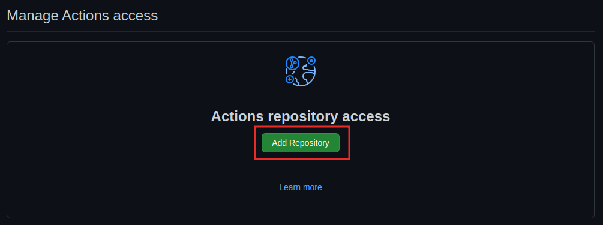
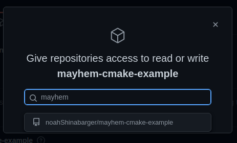
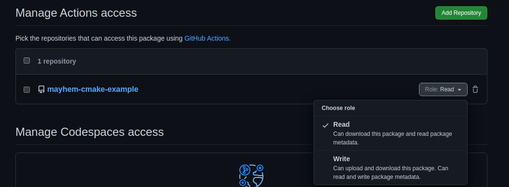
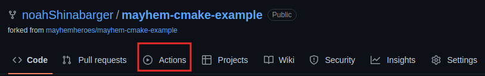
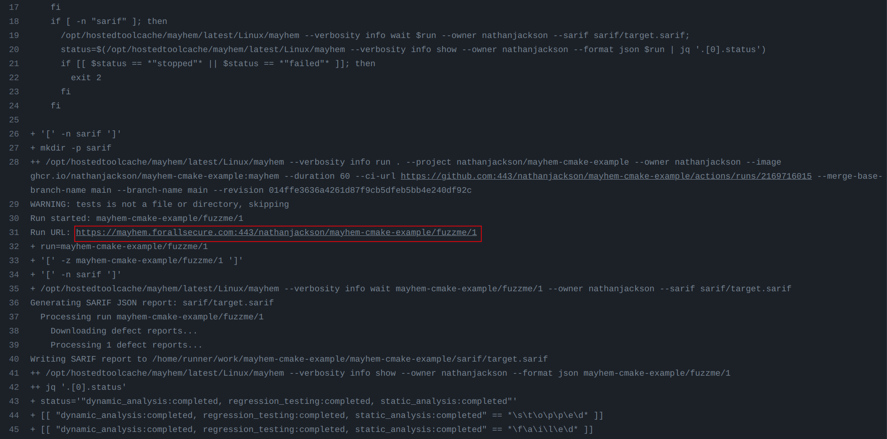

# Mayhem + GitHub Actions

In this exercise you will setup a GitHub Action that analyzes a toy project automatically everytime there is a push to the repository.

## Create a new branch for Mayhem

In the CMake and libFuzzer exercises, we forked the original or "upstream" mayhem-cmake-example repo.

1. Change into the mayhem cmake-example directory.
    ```
    cd mayhem-cmake-example/
    ```
2. Check the status of the local files.
    ```
    git status
    ```
    You should see a message indicating that your local copies of fuzzme.c and CMakeLists.txt differ from the repo.
    ```
    On branch master
    Your branch is up to date with 'origin/master'.

    Changes not staged for commit:
      (use "git add <file>..." to update what will be committed)
      (use "git restore <file>..." to discard changes in working directory)
            modified:   CMakeLists.txt
            modified:   fuzzme.c

    Untracked files:
      (use "git add <file>..." to include in what will be committed)
            build/

    no changes added to commit (use "git add" and/or "git commit -a")
    ```

3. Let's create a new branch to hold our changes by doing
    
    ```
    git checkout -b mayhem
    ```
5. And then add `fuzzme.c` and `CMakeLists.txt` to the staged files that will be commited with

    ```
    git add fuzzme.c CMakeLists.txt
    ```
6. And finally let's commit and push our changes to the new branch. (You may need to give Github a username and personal access token. This is where you can use the token you created from [the Docker+Mayhem exercise](https://github.com/mayhemheroes/hackathon-resources/blob/main/docker-intro.md)!)

If you're running out of a VM, you'll probably need to configure the name ane email for git before you can commit anything. You can do that with these commands:

```
git config --global user.email "<email>"
git config --global user.name "<Your name>"
```
    
And once the email and name have been set, you can go ahead and commit and push.


```
git commit -m 'convert to libFuzzer target'
git push --set-upstream origin mayhem
```


## Create a Dockerfile

1. Copy `Dockerfile.template` to `Dockerfile`

    ```
    cp Dockerfile.template Dockerfile
    ```

2. There are two comments marked as TODO in the Dockerfile you'll need to change in your favorite text editor. For the first section, you need to add the build commands from steps 6-8 of the previous section using Dockerfile `RUN` entries. Under the second TODO, you need to change the COPY command so that it copies the libFuzzer executable (that you ran in step 9 of the previous section) into the packaging stage.

    If you're stuck, ask!

3. Once you've created your Dockerfile, you can test the build process by running the following command:

    ```
    docker build -t ghcr.io/<Your Github Username>/mayhem-cmake-example:latest .
    ```

4. If the build succeeded without error, you should be able to run the fuzz target inside the Docker container:

    ```
    docker run --rm -it ghcr.io/<Your Github Username>/mayhem-cmake-example /fuzzme
    ```

At the end you should see the the libFuzzer output again:

```
INFO: Seed: 2682090316
INFO: Loaded 1 modules   (7 inline 8-bit counters): 7 [0x4e8040, 0x4e8047), 
INFO: Loaded 1 PC tables (7 PCs): 7 [0x4be940,0x4be9b0), 
INFO: -max_len is not provided; libFuzzer will not generate inputs larger than 4096 bytes
INFO: A corpus is not provided, starting from an empty corpus
#2	INITED cov: 3 ft: 4 corp: 1/1b exec/s: 0 rss: 24Mb
#3	NEW    cov: 4 ft: 5 corp: 2/2b lim: 4 exec/s: 0 rss: 24Mb L: 1/1 MS: 1 ShuffleBytes-
#2769	NEW    cov: 5 ft: 6 corp: 3/3b lim: 29 exec/s: 0 rss: 24Mb L: 1/1 MS: 1 ChangeByte-
#19447	NEW    cov: 6 ft: 7 corp: 4/5b lim: 191 exec/s: 0 rss: 24Mb L: 2/2 MS: 3 InsertByte-ShuffleBytes-ChangeBinInt-
==37703== ERROR: libFuzzer: deadly signal
    #0 0x4aded0 in __sanitizer_print_stack_trace (/home/nathan/src/mayhem-cmake-example/build/fuzzme+0x4aded0)
    #1 0x45a1d8 in fuzzer::PrintStackTrace() (/home/nathan/src/mayhem-cmake-example/build/fuzzme+0x45a1d8)
    #2 0x43f323 in fuzzer::Fuzzer::CrashCallback() (/home/nathan/src/mayhem-cmake-example/build/fuzzme+0x43f323)
    #3 0x7f6e0d50f3bf  (/lib/x86_64-linux-gnu/libpthread.so.0+0x143bf)
    #4 0x7f6e0d1d003a in __libc_signal_restore_set /build/glibc-sMfBJT/glibc-2.31/signal/../sysdeps/unix/sysv/linux/internal-signals.h:86:3
    #5 0x7f6e0d1d003a in raise /build/glibc-sMfBJT/glibc-2.31/signal/../sysdeps/unix/sysv/linux/raise.c:48:3
    #6 0x7f6e0d1af858 in abort /build/glibc-sMfBJT/glibc-2.31/stdlib/abort.c:79:7
    #7 0x4ae2e3 in fuzzme (/home/nathan/src/mayhem-cmake-example/build/fuzzme+0x4ae2e3)
    #8 0x4ae370 in LLVMFuzzerTestOneInput (/home/nathan/src/mayhem-cmake-example/build/fuzzme+0x4ae370)
    #9 0x4409e1 in fuzzer::Fuzzer::ExecuteCallback(unsigned char const*, unsigned long) (/home/nathan/src/mayhem-cmake-example/build/fuzzme+0x4409e1)
    #10 0x440125 in fuzzer::Fuzzer::RunOne(unsigned char const*, unsigned long, bool, fuzzer::InputInfo*, bool*) (/home/nathan/src/mayhem-cmake-example/build/fuzzme+0x440125)
    #11 0x4423c7 in fuzzer::Fuzzer::MutateAndTestOne() (/home/nathan/src/mayhem-cmake-example/build/fuzzme+0x4423c7)
    #12 0x4430c5 in fuzzer::Fuzzer::Loop(std::__Fuzzer::vector<fuzzer::SizedFile, fuzzer::fuzzer_allocator<fuzzer::SizedFile> >&) (/home/nathan/src/mayhem-cmake-example/build/fuzzme+0x4430c5)
    #13 0x431a7e in fuzzer::FuzzerDriver(int*, char***, int (*)(unsigned char const*, unsigned long)) (/home/nathan/src/mayhem-cmake-example/build/fuzzme+0x431a7e)
    #14 0x45a8c2 in main (/home/nathan/src/mayhem-cmake-example/build/fuzzme+0x45a8c2)
    #15 0x7f6e0d1b10b2 in __libc_start_main /build/glibc-sMfBJT/glibc-2.31/csu/../csu/libc-start.c:308:16
    #16 0x40681d in _start (/home/nathan/src/mayhem-cmake-example/build/fuzzme+0x40681d)

NOTE: libFuzzer has rudimentary signal handlers.
      Combine libFuzzer with AddressSanitizer or similar for better crash reports.
SUMMARY: libFuzzer: deadly signal
MS: 1 InsertByte-; base unit: 6721d9fb11ca730b528749d7e4f9e8c52766e450
0x62,0x75,0x67,
bug
artifact_prefix='./'; Test unit written to ./crash-6885858486f31043e5839c735d99457f045affd0
Base64: YnVn
```

If this is what you saw, congratulations you just automated the build and package process! 

5. Now that the image is built, push the image to the registry like last time:

```
docker push ghcr.io/<Your GitHub Username>/mayhem-cmake-example:latest
```

6. Link the package to your `mayhem-cmake-example` repository as shown in the picture below.

    On your "Packages" page, select the `mayhem-cmake-example` you just pushed out to GitHub. Once on the package page, under the "Link this package to a repository" section, select "Connect repository" and then choose "mayhem-cmake-example" from the list.
    
    
    
7. Mark the package as public and allow writing to it

    First click on the "Package settings" option as seen below.
    
    
    Next at the bottom of the page in the visibility settings, click "Change visibility".
    
    
    And then choose "public", type `mayhem-cmake-example` and click "I understand the consequences"
    
    
    Next under "Actions repository access" click "Add repository"
    
    
    As you begin typing `mayhem-cmake-example` the repository will appear for you to click on. Click on it and the page will refresh.
    
    
    Lastly we need to set the permissions to "Write" instead of just "Read". In the "Manage Actions access" section, to the right of `mayhem-cmake-example` choose the role to be "Write".
     

Now it's time to create our Mayhemfile and setup the GitHub Action.

## Add a Mayhemfile

With your Dockerfile written, you just need to create a Mayhemfile which should be the easiest part of the process!

Create a `Mayhemfile` with the following contents in your copy of the repo. 
```
project: mayhem-cmake-example
target: fuzzme

cmds:
  - cmd: /fuzzme
```

Note that since we're setting up a GitHub Action, we can leave out many of the fields that would otherwise be required. The GitHub Action will automatically generate the fields for us.

## Setup GitHub Action

With our Dockerfile, Mayhemfile, and Token configured, we're ready to setup the GitHub Action that will run anytime the code changes.

1. In your forked repository that you've been working in, create a new directory structure like so:

    ```
    mkdir -p .github/workflows
    ```

2. Using your preferred text editor, create a new mayhem.yml with the following contents:

    ```
    name: Mayhem
    on:
      push:
      pull_request:
      workflow_dispatch:
      workflow_call:
    
    env:
      REGISTRY: ghcr.io
      IMAGE_NAME: ${{ github.repository }}
    
    jobs:
      build:
        name: ${{ matrix.os }} shared=${{ matrix.shared }} ${{ matrix.build_type }}
        runs-on: ${{ matrix.os }}
        strategy:
          matrix:
            os: [ubuntu-latest]
            shared: [false]
            build_type: [Release]
            include:
              - os: ubuntu-latest
                triplet: x64-linux
    
        steps:
          - uses: actions/checkout@v2
    
          - name: Log in to the Container registry
            uses: docker/login-action@f054a8b539a109f9f41c372932f1ae047eff08c9
            with:
              registry: ${{ env.REGISTRY }}
              username: ${{ github.actor }}
              password: ${{ secrets.GITHUB_TOKEN }}
    
          - name: Extract metadata (tags, labels) for Docker
            id: meta
            uses: docker/metadata-action@98669ae865ea3cffbcbaa878cf57c20bbf1c6c38
            with:
              images: ${{ env.REGISTRY }}/${{ env.IMAGE_NAME }}
    
          - name: Build and push Docker image
            uses: docker/build-push-action@ad44023a93711e3deb337508980b4b5e9bcdc5dc
            with:
              context: .
              push: true
              tags: ${{ steps.meta.outputs.tags }}
              labels: ${{ steps.meta.outputs.labels }}
    
          - name: Start analysis
            uses: ForAllSecure/mcode-action@v1
            with:
              mayhem-token: ${{ secrets.MAYHEM_TOKEN }}
              args: --image ${{ steps.meta.outputs.tags }} --duration 300
              sarif-output: sarif
    
          - name: Upload SARIF file(s)
            uses: github/codeql-action/upload-sarif@v1
            with:
              sarif_file: sarif
    ```
    Alternatively if you can't easily copy/paste the above (e.g. if you are using a web-based VM), you can `wget` the file from the solutions branch.

    ```
    wget -O mayhem.yml https://raw.githubusercontent.com/mayhemheroes/mayhem-cmake-example/solution/.github/workflows/mayhem.yml
    ```

3. Now we'll commit our changes to our "mayhem" branch:

    ```
    git add Dockerfile Mayhemfile .github/workflows/mayhem.yml
    git commit -m 'add GitHub action to launch Mayhem'
    git push
    ```
    
4. When you push the changes in the previous step, GitHub will automatically start the first workflow run. Go to the actions tab out on GitHub.
    
    


5. You can select the run and scroll down to the "Start Analysis" phase and you should see the link to the corresponding Mayhem run at the end of the output, here:

    
    
    Select that link and it should bring you to your Mayhem run. Congratulations, you've integrated a repository with Mayhem!
    
    Note: if you're having issues (e.g. "installation not allowed to write organization package" or other buildx errors), try the steps outlined in [this article on our community forum](https://community.forallsecure.com/t/error-buildx-call-failed-with-error-denied-installation-not-allowed-to-write-organization-package/354/2).
